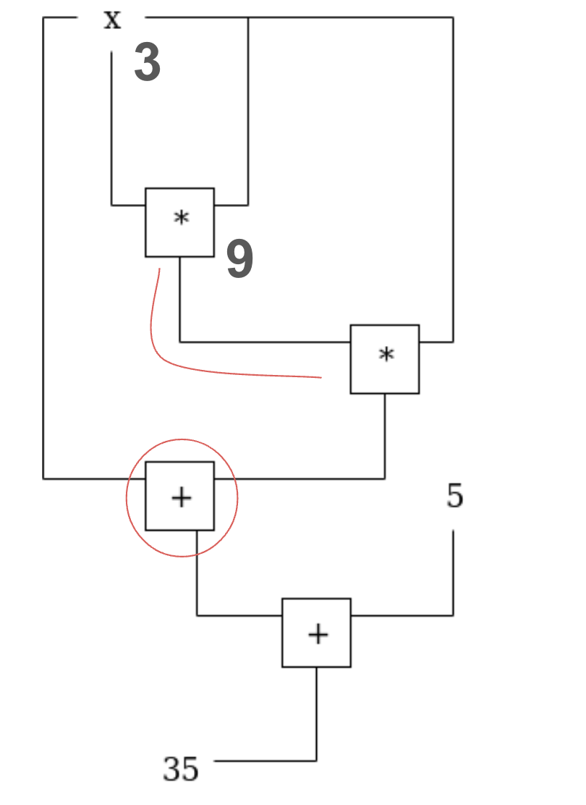

# Week 4 - PLONK

Recall that you should have some basic knowledge of Rust from completing [Rustlings](https://rustlings.cool/) in Week 0. The required exercise this week is to publish a blogpost on PLONK and present it at the end of the week with your group.

## Study

When you start to learn ZK proof system, you are really advised to start from PLONK than any other proof system. There're a bunch of amazing articles out there, but instead of jumping into a rabbit hole, you should start with [Vitalik's blog post](https://vitalik.eth.limo/general/2019/09/22/plonk.html) and focus on reading it all.
With this article you can understand what is widely used plonkish style of circuit arithmetization. For this article, you may be unable to understand all the details at once, but you should at least understand what this diagram mean:

Let's examine PLONK from a broader perspective compared to the detailed analysis in the paper. [ZKP MOOC Lec 5](https://www.youtube.com/watch?v=A0oZVEXav24)

Read Plonkathon Referenced Version. If you want to challenge yourself, You can implement it.
https://github.com/0xPARC/plonkathon/tree/reference

For a hands-on, step-by-step understanding of PLONK's mechanics, consider the "PLONK by Hand" series:
- PLONK by Hand, Part 1: [https://research.metastate.dev/plonk-by-hand-part-1/](https://research.metastate.dev/plonk-by-hand-part-1/)
- PLONK by Hand, Part 2 - The Proof: [https://research.metastate.dev/plonk-by-hand-part-2-the-proof/](https://research.metastate.dev/plonk-by-hand-part-2-the-proof/)
- PLONK by Hand, Part 3 - Verification: [https://research.metastate.dev/plonk-by-hand-part-3-verification/](https://research.metastate.dev/plonk-by-hand-part-3-verification/)

PLONK and Custom Gates with Adrian Hamelink: [https://zkhack.dev/whiteboard/module-five/]

## Noir Circuits

- **Noir Programming And ZK Circuits:** Step into the world of Noir, a domain-specific programming language for writing circuits, and learn to build zero-knowledge (ZK) apps. The Noir Programming and ZK Circuits course will teach you how to write circuits, how to build a full ZK protocol from scratch (using Noir, Barretenberg, and Solidity), and how to build the backend of a full-stack, privacy-preserving ZK application.-[Noir Programming And ZK Circuits](https://updraft.cyfrin.io/courses/noir-programming-and-zk-circuits)
  
- **NoirHack:** In this kickoff session of NoirHack, a 4-week virtual builder sprint, we dive into how to learn, build, and ship the next wave of private apps using Noir- [Playlist NoirHack](https://www.youtube.com/playlist?list=PLabpoAlaCBY0tlBYmY3Wa8PGEIxIdalWa)

- [ZKCamp's Open Source Noir course](https://github.com/ZKCamp/aztec-noir-course)
  - 6 lectures to give participants the knowledge and skills necessary to build decentralized applications based on ZKPs using Noir
  - Lessons include ZKP Fundamentals; An Introduction to Aztec Ecosystem; Noir Basics; Building a Noir Application; and Advanced Noir
- [BattleZips-Noir](https://www.youtube.com/playlist?list=PLWACGbvIsEgnR2aUCr9i-PpmTVhF5Zuik) ([Source Code](https://github.com/BattleZips/BattleZips-Noir))
  - Walkthrough of building an on-chain Battleships game using zero-knowledge
  - Follow along and build your own game using Noir

### Reference Material (optional)

In order to understand PLONKathon, you might need to understand the following concepts, but only read it when you really feel like it.

1. There's the [website for plonkathon](https://plonkathon.com/), at this moment, you should already understand elliptic curve, pairing. You might need to understand Fiat-Shamir heuristic and Fast Fourier Transform to understand the code. They also have [video play list explaining each stage](https://www.youtube.com/playlist?list=PLNK7oFq6eaEzHNYHpQ_zbgPEBDhLmyfFb)
2. Schwartz Zippel Lemma https://brilliant.org/wiki/schwartz-zippel-lemma/
3. Lagrange interpolation https://en.wikipedia.org/wiki/Lagrange_polynomial
4. FFT https://www.youtube.com/watch?v=h7apO7q16V0. Put it simply, FFT and Inverse FFT are turning polynomials from coefficient domain into evaluation domain and vice versa.
5. Fiat-Shamir heuristic. Put it simply, normally interactive proof is done by sending the challenge to the verifier and the verifier will send the challenge to the prover. It's a way to turn the interactive proof into non-interactive proof by hashing the existing computation trace and use it as the challenge. 
6. Libraries for PLONK implementation, with a focus on production-level implementations: [Jellyfish](https://github.com/EspressoSystems/jellyfish), [Dusk-network](https://github.com/dusk-network/plonk)
